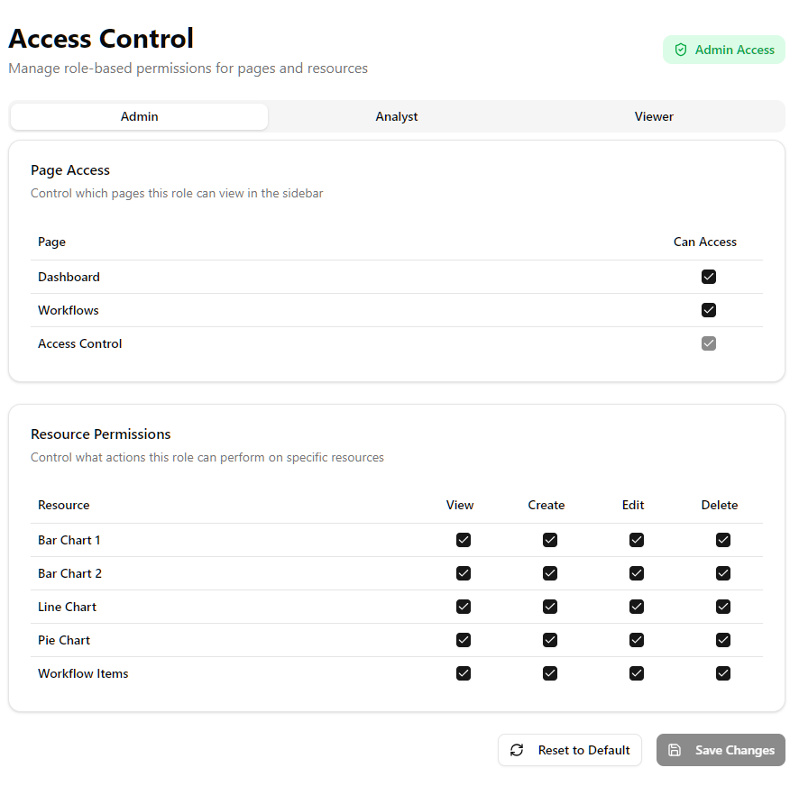

# omni_console

The console that sees everything

## 🚀 Live Demo

Visit the application: [https://omni-console.onrender.com](https://omni-console.onrender.com)

## Overview

Omni Console is a full-stack dashboard application with a robust role-based authentication system. It provides secure access control with different permission levels for different user roles.

## 🔐 Role-Based Authentication

### Frontend Implementation

The frontend uses React Query and Next.js with a custom authentication flow:

-   **`useAuth` Hook**: Manages user authentication state with automatic token validation via `authQueryOptions`
-   **`AuthProvider`**: Wraps protected routes to ensure only authenticated users can access protected pages
-   **Auto-Redirect**: Unauthenticated users are automatically redirected to `/sign-in`
-   **Axios Interceptor**: Configured with `withCredentials: true` to automatically send cookies with every request
-   **401 Handling**: Response interceptors detect unauthorized requests and redirect to sign-in

### Backend Implementation

The backend uses Express.js with JWT authentication:

-   **User Registration**: Users register with email, password, and a default role (`viewer`)
-   **JWT Tokens**: Access tokens are issued upon login with 15-minute expiry
-   **httpOnly Secure Cookies**: Tokens are stored in `httpOnly` cookies, preventing JavaScript access and XSS attacks
-   **Role-Based Middleware**: `requireAdmin` middleware checks user role and denies access to non-admin users
-   **Password Security**: Passwords are hashed using bcrypt before storage

### Security Features

✅ **httpOnly Secure Cookies**: Adds a critical layer of protection by preventing client-side JavaScript from accessing authentication tokens, effectively mitigating XSS attacks

✅ **SameSite Cookie Policy**: Set to `none` in production and `lax` in development to prevent CSRF attacks

✅ **Secure Flag**: Enabled in production to ensure cookies are only transmitted over HTTPS

✅ **Token Expiry**: Tokens automatically expire after 15 minutes, requiring re-authentication

### User Roles

-   **admin**: Full access to all features and admin controls
-   **viewer**: Limited read-only access to dashboards and data

---

_Built with Next.js, Express.js, MongoDB, and TypeScript_
